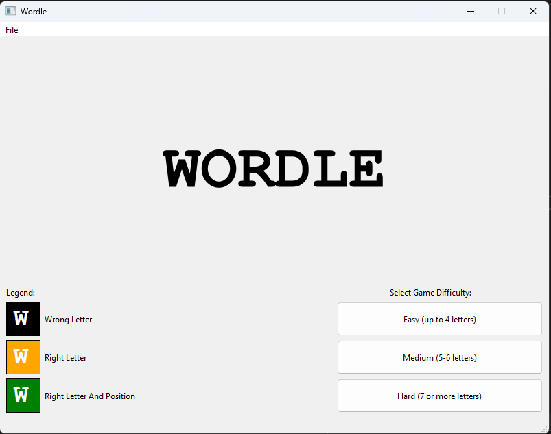
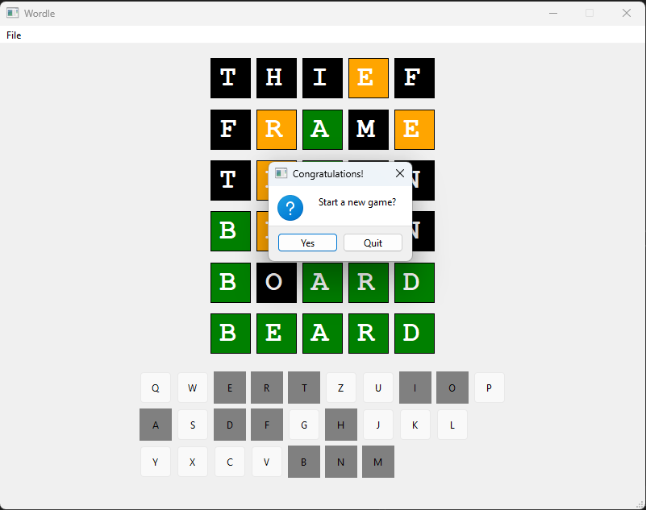

# Wordle
A desktop (Windows) version of the [Wordle](https://www.nytimes.com/games/wordle/index.html) game.
## About
- A C++ school project designed in visual studion using QT library
## Gameplay
- At the oppening screen select the desired dificulty
- The game will select a word and give you 6 chances to guess that word
- The only information you have is the number of letters in the word (Represented by the number of fields in every row/chance)
- Input your word by typing it on your keyboard
- Backspace key to delete/edit your guess
- Enter key to submit your guess
- Green fields mean that the wanted word contains those letters in those exact positions
- Orange fields mean that the wanted word contains those letter but in different positions
- Black fields mean that the wanted word doesn't contain those letters
- The game ends after you have guessed the wanted word or when you run out of chances
- At that point the game will ask you if you want a new game or exit the app
## Word pool
- Words from which the game selects a random word for the player to guess, are contained in the WordSet.txt file
- If you want to offer the game different words to choose from, just edit the WordSet.txt file with your provided words
- (Just remember to have 1 word per line of text)
## Requirements
- Visual studio 2022
- QT Visual Studio Tools extension
- QT 6.5.2 version
## Required DLLs to run without using visual studio
- Qt6Widgets.dll
- Qt6Gui.dll
- Qt6Core.dll
- Works with different older versions of the above DLLs
- Store the DLLs and the WordSet.txt file in the same location/folder as Wordle.exe
## Setup instructions (Visual Studio)
1) If you dont have QT installed, go [Here](https://www.qt.io/offline-installers) and download 6.5.2 version for Windows
2) In Visual Studio go to the Extensions tab and select Manage Extensions
3) Search for QT Visual Studio Tools and install it
4) After installing go to Extensions\QT VS Tools\QT Versions
5) Click on *add new QT version* and enter the path to the qmake.exe found in ...\Qt\6.5.2\msvc2019_64\bin
6) Version and Host columns will fill automatically after you add the Path. Select the version as default and click OK
7) Clone this repository and build !
## Screenshots

